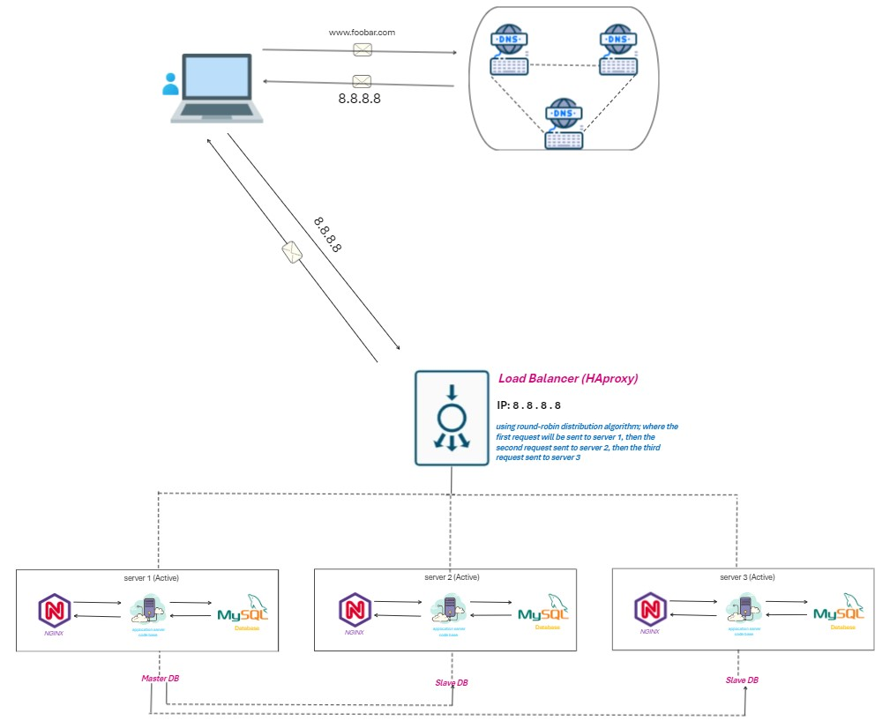

ALX Project - Web Infrastructure Design

Task 1: Definitions and Explanations
1. Adding a New Server
Adding a new server is essential to enhance the system's capacity to handle increased traffic. Additionally, it allows the implementation of a load balancer to distribute the load evenly, eliminating a single point of failure associated with having only one server.

2. Load Balancer Distribution Algorithm
Our load balancer employs the Round Robin algorithm, which serves requests sequentially to each server in order. This ensures a balanced distribution of incoming traffic among the servers, making it suitable for setups with equal server specifications and without many persistent connections.

3. Load-Balancer Setup: Active-Active
The load balancer is configured for an Active-Active setup, where both nodes (servers) actively run the same service simultaneously. This contrasts with an Active-Passive setup, where not all nodes are active, and the backup node is only engaged during failover. Active-Active clusters provide continuous access to all server resources, enhancing performance.

4. Database Primary-Replica (Master-Slave) Cluster
The database employs a master-slave replication model, where data from the master is replicated to one or more slave servers. This replication mechanism, whether synchronous or asynchronous, is used for scalability, failover, and distributing read access among multiple servers.

5. Primary Node vs. Replica Node
In the application context, the primary node is the main server handling write operations, while replica nodes provide redundant copies of the application codebase. Replicas enhance reliability by protecting against hardware failures and increasing capacity for handling read requests.

Issues
A. Single Point of Failure (SPOF)
The primary single point of failure is the presence of only one load balancer. To mitigate this, consider implementing redundancy or failover mechanisms for the load balancer.

B. Security Issues
Major security concerns include the lack of HTTPS, making data susceptible to interception, and the absence of a firewall, which exposes the system to potential denial of service (DoS) attacks and unauthorized access. Implementing HTTPS and a robust firewall is crucial for securing the system.

C. Lack of Monitoring
Monitoring is crucial for identifying and addressing problems, downtime, or security threats promptly. Implementing a robust monitoring system enhances system reliability, improves user experience, and allows for proactive issue resolution.

References
Introduction to Load Balancers
MySQL Master-Slave Replication Tutorial
Understanding Active-Active Configurations
Note: Ensure to review and update security measures, and consider redundancy options to address identified issues. Regularly monitor the system for optimal performance and security.