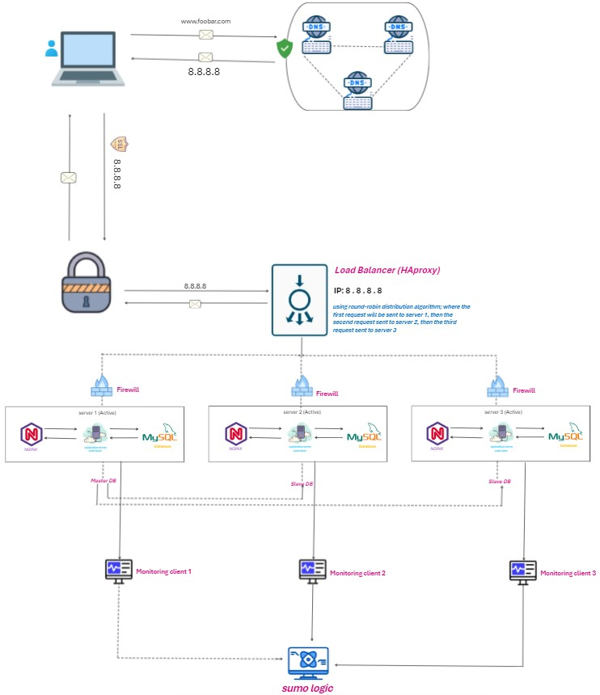

ALX Project
Web infrastructure design

Task 2.
Definitions and Explanations.
1. For every additional element, why are adding it; we have added three new
components; a firewall for each server to protect them from being attacked and exploited,
1 SSL certificate to server www.foobar.com over HTTPS and three monitoring clients
that will collect logs and send them to our data collector Sumologic.
2. What are firewalls for; is a network security system that monitors and controls incoming
and outgoing network traffic based on predetermined security rules. It basically
establishes a barrier between a trusted network and an untrusted network.
3. Why is the traffic served over HTTPS; because previously the traffic was passed over
Hypertext Transfer Protocol (HTTP) which transfers data in plain text while HTTPS is
secure where the data is encrypted using Transfer Layer Security (TLS).
4. What monitoring is used for; it provides the capability to detect and diagnose any web
application performance issues proactively.
5. How the monitoring tool is collecting data; it collects logs of the application server,
MySQL Database and Nginx web server. A log in a computing context is the
automatically produced and time-stamped documentation of events relevant to a
particular system.
6. Explain what to do if you want to monitor your web server QPS; one web server
handles 1K queries per second (QPS), I would basically monitor it from the network and
application level.
Issues
A. Why terminating SSL at the load balancer level is an issue; it is an issue because
decryption is resource and CPU intensive. Placing the decryption burden on the load
balancer enables the server to spend processing power on application tasks but to be
honest I don’t know see the issue to be honest (I will update this).
B. Why having only one MySQL server capable of accepting writes is an issue;
because once it is down it means do data can be added or updated meaning some
features of the application won’t work.
C. Why having servers with all the same components (database, web server and
application server) might be a problem; this is because once you have a bug in one of
the components in one of the servers then the bug will be valid in the other servers.