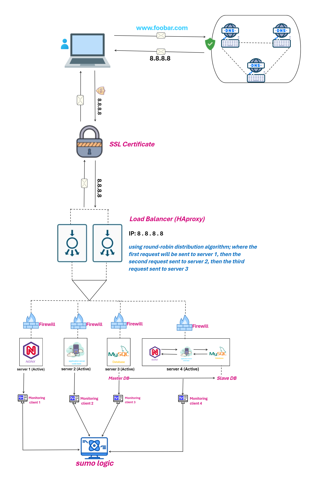

ALX Project - Web Infrastructure Design

Task 3: Definitions and Explanations
1. Additional Elements Added:
New Server:

Purpose: Separation of components (Nginx, Code base, MySQL) onto dedicated servers.
Advantages:
Isolation enhances security and stability.
Redundancy with an extra server serving as a backup in case of component or server failure.
Monitoring and Security: Each server is equipped with monitoring capabilities and a firewall.
Additional Load Balancer:

Purpose: Enhanced traffic handling across the entire infrastructure.
Advantages:
Improved scalability by distributing incoming requests.
Redundancy and failover support.